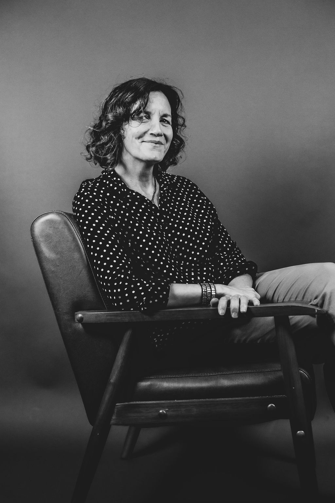

If you had told teenage me that one day I’d love speaking to groups, I would have laughed. Isn’t it wonderful how we never stop growing and changing? 

Topics I love to speak about include:

- Journaling to facilitate growth
- How letting go makes room for a better future 
- Transformation through grief and loss  
- Leaning into your character strengths to create momentum
- Recovering from codependency
- Developing a gratitude practice
- Finding and living with joy
- Mindset and perspective
- Hearing God's voice
- The writing and publishing process

I will speak to your group, big or small, and tailor the message to your audience. I also lead workshops, serve as a panelist, and facilitate retreats. [Contact](/contact) me to discuss the possibilities.